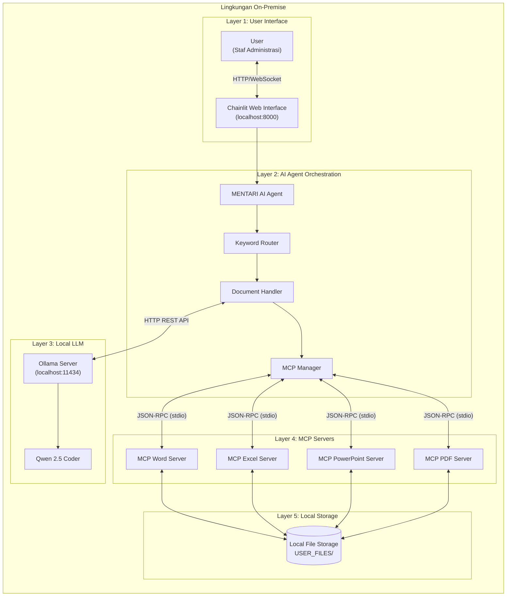
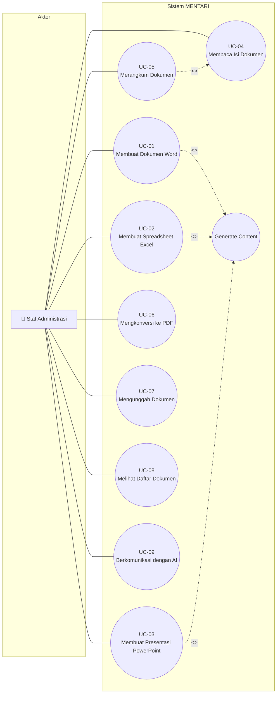
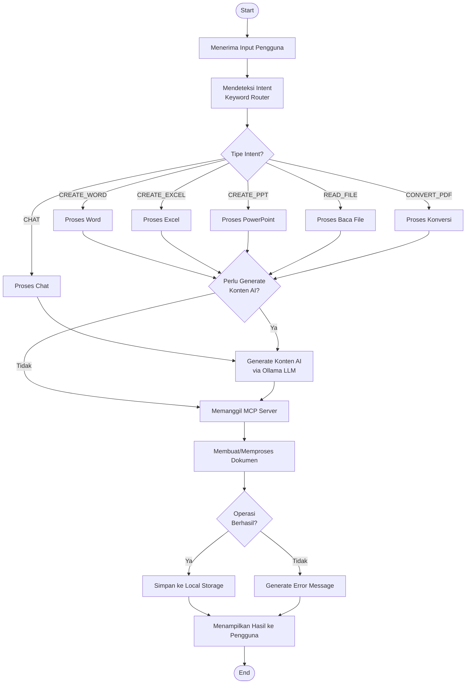
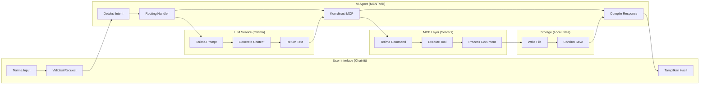
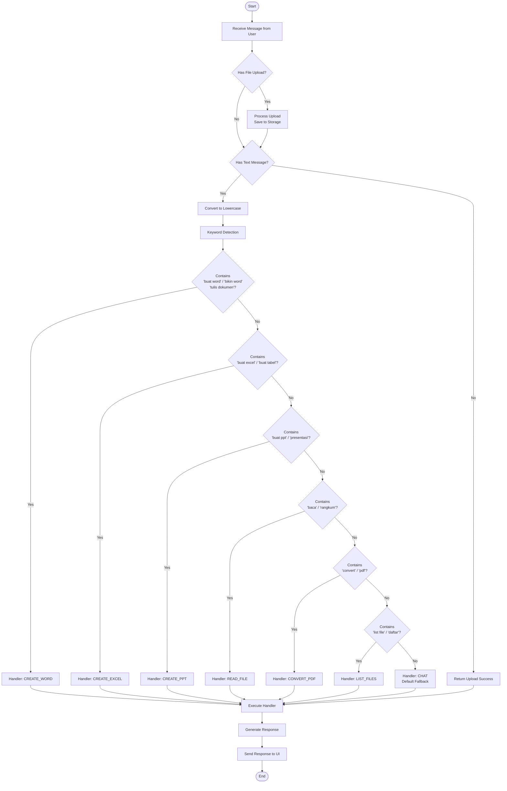

# Dokumentasi Diagram Sistem MENTARI

## Implementasi AI Agent Orchestration untuk Efisiensi Administrasi Strahan Kementerian Pertahanan

---

# Diagram 1: System Architecture Diagram (System Context Diagram)

## Judul Formal
**Diagram Arsitektur Sistem AI Agent Orchestration MENTARI**

## Tujuan Diagram
Diagram ini menggambarkan arsitektur keseluruhan sistem MENTARI sebagai platform AI Agent Orchestration yang berjalan secara on-premise. Diagram menunjukkan hubungan antar komponen utama, aliran data, dan protokol komunikasi yang digunakan dalam sistem untuk mendukung otomasi administrasi dokumen di lingkungan Kementerian Pertahanan.

## Komponen Sistem

| No | Komponen | Deskripsi | Teknologi |
|----|----------|-----------|-----------|
| 1 | User | Pengguna akhir (staf administrasi) | - |
| 2 | Chainlit Web Interface | Antarmuka pengguna berbasis web | Chainlit (Python) |
| 3 | MENTARI AI Agent | Agen AI utama untuk orkestrasi | Python, LangChain |
| 4 | Keyword Router | Modul deteksi intent berbasis keyword | Python |
| 5 | Document Handler | Modul penanganan operasi dokumen | Python |
| 6 | MCP Manager | Manajer koneksi ke MCP Servers | Python, MCP SDK |
| 7 | Ollama Server | Server LLM lokal | Ollama |
| 8 | LLM Model | Model bahasa besar | Qwen 2.5 Coder |
| 9 | MCP Word Server | Server MCP untuk dokumen Word | Python |
| 10 | MCP Excel Server | Server MCP untuk spreadsheet | Python |
| 11 | MCP PowerPoint Server | Server MCP untuk presentasi | Python |
| 12 | MCP PDF Server | Server MCP untuk dokumen PDF | Python |
| 13 | Local File Storage | Penyimpanan dokumen lokal | Filesystem |

## Hubungan Antar Komponen

| Dari | Ke | Tipe Komunikasi | Protokol |
|------|-----|-----------------|----------|
| User | Chainlit Web Interface | Request/Response | HTTP/WebSocket |
| Chainlit Web Interface | MENTARI AI Agent | Function Call | Internal |
| MENTARI AI Agent | Keyword Router | Function Call | Internal |
| Keyword Router | Document Handler | Intent Routing | Internal |
| Document Handler | Ollama Server | REST API | HTTP (localhost:11434) |
| Document Handler | MCP Manager | Function Call | Internal |
| MCP Manager | MCP Word Server | JSON-RPC | stdio |
| MCP Manager | MCP Excel Server | JSON-RPC | stdio |
| MCP Manager | MCP PowerPoint Server | JSON-RPC | stdio |
| MCP Manager | MCP PDF Server | JSON-RPC | stdio |
| MCP Servers (All) | Local File Storage | File I/O | Filesystem |

## Layout
**Rekomendasi:** Top-Down dengan 5 layer horizontal

```
┌─────────────────────────────────────────────────────────────────────────────┐
│                        LINGKUNGAN ON-PREMISE (LOKAL)                        │
├─────────────────────────────────────────────────────────────────────────────┤
│  ┌─────────────────────────────────────────────────────────────────────┐    │
│  │                     LAYER 1: USER INTERFACE                         │    │
│  │  ┌──────────┐         ┌──────────────────────────┐                  │    │
│  │  │   User   │◄───────►│   Chainlit Web Interface │                  │    │
│  │  └──────────┘  HTTP   └──────────────────────────┘                  │    │
│  └─────────────────────────────────────────────────────────────────────┘    │
│                                    │                                        │
│                                    ▼                                        │
│  ┌─────────────────────────────────────────────────────────────────────┐    │
│  │                  LAYER 2: AI AGENT ORCHESTRATION                    │    │
│  │  ┌──────────────────────────────────────────────────────────────┐   │    │
│  │  │                    MENTARI AI Agent                          │   │    │
│  │  │  ┌────────────────┐  ┌──────────────────┐  ┌──────────────┐  │   │    │
│  │  │  │ Keyword Router │─►│ Document Handler │─►│  MCP Manager │  │   │    │
│  │  │  └────────────────┘  └──────────────────┘  └──────────────┘  │   │    │
│  │  └──────────────────────────────────────────────────────────────┘   │    │
│  └─────────────────────────────────────────────────────────────────────┘    │
│                    │                              │                         │
│          HTTP REST │                    JSON-RPC  │                         │
│                    ▼                              ▼                         │
│  ┌──────────────────────┐    ┌─────────────────────────────────────────┐    │
│  │   LAYER 3: LLM       │    │         LAYER 4: MCP SERVERS            │    │
│  │  ┌────────────────┐  │    │  ┌─────────┐ ┌─────────┐ ┌───────────┐  │    │
│  │  │ Ollama Server  │  │    │  │MCP Word │ │MCP Excel│ │MCP PowerPt│  │    │
│  │  │  ┌──────────┐  │  │    │  └────┬────┘ └────┬────┘ └─────┬─────┘  │    │
│  │  │  │Qwen 2.5  │  │  │    │       │           │            │        │    │
│  │  │  │ Coder    │  │  │    │  ┌────┴───────────┴────────────┴────┐   │    │
│  │  │  └──────────┘  │  │    │  │           MCP PDF Server         │   │    │
│  │  └────────────────┘  │    │  └──────────────────────────────────┘   │    │
│  └──────────────────────┘    └─────────────────────────────────────────┘    │
│                                              │                              │
│                                              ▼                              │
│  ┌─────────────────────────────────────────────────────────────────────┐    │
│  │                     LAYER 5: LOCAL STORAGE                          │    │
│  │           ┌─────────────────────────────────────┐                   │    │
│  │           │      Local File Storage (USER_FILES)│                   │    │
│  │           │   .docx  .xlsx  .pptx  .pdf  .txt   │                   │    │
│  │           └─────────────────────────────────────┘                   │    │
│  └─────────────────────────────────────────────────────────────────────┘    │
└─────────────────────────────────────────────────────────────────────────────┘
```

## Mermaid Syntax



---

# Diagram 2: Use Case Diagram

## Judul Formal
**Diagram Use Case Sistem AI Agent Orchestration MENTARI**

## Tujuan Diagram
Diagram ini mengidentifikasi aktor-aktor yang berinteraksi dengan sistem MENTARI beserta use case (kasus penggunaan) yang tersedia. Diagram menggambarkan fungsionalitas utama sistem dari perspektif pengguna untuk mendukung otomasi administrasi dokumen.

## Aktor

| No | Aktor | Deskripsi |
|----|-------|-----------|
| 1 | Staf Administrasi | Pengguna utama yang membuat dan mengelola dokumen |
| 2 | Sistem MENTARI | Aktor sekunder (sistem AI Agent) |

## Use Cases

| No | Use Case ID | Nama Use Case | Deskripsi |
|----|-------------|---------------|-----------|
| UC-01 | CREATE_WORD | Membuat Dokumen Word | Membuat dokumen Word baru dengan konten yang di-generate AI |
| UC-02 | CREATE_EXCEL | Membuat Spreadsheet Excel | Membuat spreadsheet Excel dengan data tabular |
| UC-03 | CREATE_PPT | Membuat Presentasi PowerPoint | Membuat presentasi dengan slide yang di-generate AI |
| UC-04 | READ_FILE | Membaca Isi Dokumen | Membaca dan menampilkan konten dokumen (PDF/Word) |
| UC-05 | SUMMARIZE | Merangkum Dokumen | Merangkum isi dokumen menggunakan AI |
| UC-06 | CONVERT_PDF | Mengkonversi ke PDF | Mengkonversi dokumen Word menjadi format PDF |
| UC-07 | UPLOAD_FILE | Mengunggah Dokumen | Mengunggah dokumen ke sistem untuk diproses |
| UC-08 | LIST_FILES | Melihat Daftar Dokumen | Menampilkan daftar dokumen yang tersedia |
| UC-09 | CHAT | Berkomunikasi dengan AI | Berinteraksi dengan AI untuk pertanyaan umum |

## Hubungan Use Case

| Tipe | Use Case Utama | Use Case Terkait | Keterangan |
|------|----------------|------------------|------------|
| Include | UC-01, UC-02, UC-03 | Generate Content (AI) | Pembuatan dokumen memerlukan AI untuk generate konten |
| Include | UC-05 | UC-04 | Merangkum memerlukan pembacaan dokumen terlebih dahulu |
| Extend | UC-01 | UC-06 | Setelah membuat Word, dapat mengkonversi ke PDF |
| Extend | UC-07 | UC-04, UC-05 | Setelah upload, dapat membaca atau merangkum |

## Layout
**Rekomendasi:** Left-Right dengan aktor di kiri dan use cases di tengah

```
┌─────────────────────────────────────────────────────────────────────────────┐
│                          SISTEM MENTARI                                     │
│  ┌───────────────────────────────────────────────────────────────────────┐  │
│  │                                                                       │  │
│  │     ┌─────────────────────────────────────────────┐                   │  │
│  │     │  ○ UC-01: Membuat Dokumen Word              │                   │  │
│  │     └─────────────────────────────────────────────┘                   │  │
│  │                          │                                            │  │
│  │     ┌─────────────────────────────────────────────┐                   │  │
│  │     │  ○ UC-02: Membuat Spreadsheet Excel         │                   │  │
│  │     └─────────────────────────────────────────────┘                   │  │
│  │                                                                       │  │
┌──┴──┐  ┌─────────────────────────────────────────────┐                   │  │
│     │  │  ○ UC-03: Membuat Presentasi PowerPoint     │                   │  │
│ 👤  │──┤─────────────────────────────────────────────┤                   │  │
│Staf │  │  ○ UC-04: Membaca Isi Dokumen               │◄──────┐           │  │
│Admin│  └─────────────────────────────────────────────┘       │           │  │
│     │                                                   <<include>>      │  │
└──┬──┘  ┌─────────────────────────────────────────────┐       │           │  │
│  │     │  ○ UC-05: Merangkum Dokumen                 │───────┘           │  │
│  │     └─────────────────────────────────────────────┘                   │  │
│  │                                                                       │  │
│  │     ┌─────────────────────────────────────────────┐                   │  │
│  │     │  ○ UC-06: Mengkonversi ke PDF               │                   │  │
│  │     └─────────────────────────────────────────────┘                   │  │
│  │                                                                       │  │
│  │     ┌─────────────────────────────────────────────┐                   │  │
│  │     │  ○ UC-07: Mengunggah Dokumen                │                   │  │
│  │     └─────────────────────────────────────────────┘                   │  │
│  │                                                                       │  │
│  │     ┌─────────────────────────────────────────────┐                   │  │
│  │     │  ○ UC-08: Melihat Daftar Dokumen            │                   │  │
│  │     └─────────────────────────────────────────────┘                   │  │
│  │                                                                       │  │
│  │     ┌─────────────────────────────────────────────┐                   │  │
│  │     │  ○ UC-09: Berkomunikasi dengan AI           │                   │  │
│  │     └─────────────────────────────────────────────┘                   │  │
│  │                                                                       │  │
│  └───────────────────────────────────────────────────────────────────────┘  │
└─────────────────────────────────────────────────────────────────────────────┘
```

## Mermaid Syntax



---

# Diagram 3: Activity Diagram (Main Workflow)

## Judul Formal
**Diagram Aktivitas Alur Kerja Utama Sistem MENTARI**

## Tujuan Diagram
Diagram ini menggambarkan alur aktivitas utama dalam sistem MENTARI, mulai dari input pengguna hingga output dokumen. Diagram menunjukkan urutan langkah-langkah, keputusan kondisional, dan aktivitas paralel dalam proses pembuatan dokumen otomatis.

## Daftar Aktivitas

| No | Aktivitas | Deskripsi |
|----|-----------|-----------|
| A1 | Start | Titik awal proses |
| A2 | Menerima Input Pengguna | Sistem menerima perintah dari pengguna |
| A3 | Mendeteksi Intent | Keyword Router menganalisis jenis permintaan |
| A4 | Memproses Intent | Document Handler menangani permintaan berdasarkan intent |
| A5 | Generate Konten AI | LLM menghasilkan konten teks |
| A6 | Memanggil MCP Server | MCP Manager memanggil server yang sesuai |
| A7 | Membuat Dokumen | MCP Server membuat/memodifikasi dokumen |
| A8 | Menyimpan ke Storage | Dokumen disimpan ke local storage |
| A9 | Menampilkan Hasil | Sistem menampilkan hasil ke pengguna |
| A10 | End | Titik akhir proses |

## Decision Points

| No | Keputusan | Kondisi | Cabang |
|----|-----------|---------|--------|
| D1 | Tipe Intent? | CREATE_WORD / CREATE_EXCEL / CREATE_PPT / READ_FILE / CONVERT_PDF / CHAT | 6 cabang |
| D2 | Perlu AI Content? | Ya / Tidak | 2 cabang |
| D3 | Operasi Berhasil? | Sukses / Gagal | 2 cabang |

## Layout
**Rekomendasi:** Top-Down dengan decision diamonds

```
                              ┌───────┐
                              │ START │
                              └───┬───┘
                                  │
                                  ▼
                    ┌─────────────────────────────┐
                    │   Menerima Input Pengguna   │
                    └─────────────┬───────────────┘
                                  │
                                  ▼
                    ┌─────────────────────────────┐
                    │     Mendeteksi Intent       │
                    │     (Keyword Router)        │
                    └─────────────┬───────────────┘
                                  │
                                  ▼
                        ┌─────────────────┐
                       ╱                   ╲
                      ╱   Tipe Intent?      ╲
                     ╱                       ╲
                    ╱─────────────────────────╲
                   │                           │
      ┌────────────┼───────────┬───────────────┼────────────┐
      │            │           │               │            │
      ▼            ▼           ▼               ▼            ▼
┌──────────┐ ┌──────────┐ ┌──────────┐ ┌──────────┐ ┌──────────┐
│  CREATE  │ │  CREATE  │ │  CREATE  │ │   READ   │ │  CONVERT │
│   WORD   │ │  EXCEL   │ │   PPT    │ │   FILE   │ │   PDF    │
└────┬─────┘ └────┬─────┘ └────┬─────┘ └────┬─────┘ └────┬─────┘
      │            │           │               │            │
      └────────────┴─────┬─────┴───────────────┴────────────┘
                         │
                         ▼
               ┌─────────────────┐
              ╱                   ╲
             ╱  Perlu Generate    ╲
            ╱   Konten AI?         ╲
           ╱                        ╲
          ╱──────────────────────────╲
         │ Ya                      Tidak│
         ▼                              │
┌─────────────────────────┐             │
│  Generate Konten AI     │             │
│  (Ollama LLM)           │             │
└───────────┬─────────────┘             │
            │                           │
            └───────────┬───────────────┘
                        │
                        ▼
          ┌─────────────────────────────┐
          │   Memanggil MCP Server      │
          │   (JSON-RPC)                │
          └─────────────┬───────────────┘
                        │
                        ▼
          ┌─────────────────────────────┐
          │   Membuat/Memproses         │
          │   Dokumen                   │
          └─────────────┬───────────────┘
                        │
                        ▼
              ┌─────────────────┐
             ╱                   ╲
            ╱  Operasi Berhasil?  ╲
           ╱                       ╲
          ╱─────────────────────────╲
         │ Ya                    Tidak│
         ▼                            ▼
┌───────────────────┐      ┌───────────────────┐
│Simpan ke Storage  │      │ Tampilkan Error   │
└─────────┬─────────┘      └─────────┬─────────┘
          │                          │
          └──────────┬───────────────┘
                     │
                     ▼
       ┌─────────────────────────────┐
       │   Menampilkan Hasil ke      │
       │   Pengguna                  │
       └─────────────┬───────────────┘
                     │
                     ▼
                ┌─────────┐
                │   END   │
                └─────────┘
```

## Mermaid Syntax



---

# Diagram 4: Swimlane Diagram (Responsibility-Based Workflow)

## Judul Formal
**Diagram Swimlane Pembagian Tanggung Jawab Sistem MENTARI**

## Tujuan Diagram
Diagram ini menggambarkan alur kerja sistem MENTARI dengan pembagian tanggung jawab berdasarkan komponen/layer sistem. Setiap lane merepresentasikan sebuah komponen yang bertanggung jawab atas aktivitas tertentu dalam proses pembuatan dokumen.

## Swimlanes (Lanes)

| No | Lane | Komponen | Tanggung Jawab |
|----|------|----------|----------------|
| 1 | User Interface | Chainlit Web UI | Menerima input, menampilkan output |
| 2 | AI Agent | MENTARI Agent | Orkestrasi proses, routing intent |
| 3 | LLM Service | Ollama Server | Generate konten menggunakan AI |
| 4 | MCP Layer | MCP Servers | Operasi dokumen Office |
| 5 | Storage | Local Filesystem | Penyimpanan dokumen |

## Aktivitas per Lane

| Lane | Aktivitas |
|------|-----------|
| User Interface | Terima Input → Validasi → Kirim ke Agent → Terima Hasil → Tampilkan ke User |
| AI Agent | Deteksi Intent → Tentukan Handler → Koordinasi MCP → Compile Response |
| LLM Service | Terima Prompt → Proses Model → Generate Text → Return Response |
| MCP Layer | Terima Command → Execute Tool → Create/Read File → Return Status |
| Storage | Receive Write → Save File → Confirm → Retrieve File → Send Content |

## Layout
**Rekomendasi:** Horizontal lanes dengan flow left-to-right

```
┌────────────────────────────────────────────────────────────────────────────────────────────┐
│                                                                                            │
│  ┌──────────────┐                                                                          │
│  │     User     │   ┌─────────┐                                           ┌─────────────┐ │
│  │  Interface   │   │ Terima  │                                           │  Tampilkan  │ │
│  │  (Chainlit)  │   │ Input   │──────────────────────────────────────────►│   Hasil     │ │
│  └──────────────┘   └────┬────┘                                           └─────────────┘ │
│                          │                                                       ▲        │
├──────────────────────────┼───────────────────────────────────────────────────────┼────────┤
│  ┌──────────────┐        │                                                       │        │
│  │   AI Agent   │        ▼                                                       │        │
│  │  (MENTARI)   │   ┌─────────┐    ┌─────────┐    ┌─────────┐    ┌─────────┐     │        │
│  │              │   │ Deteksi │───►│ Routing │───►│Koordinasi───►│ Compile │─────┘        │
│  └──────────────┘   │ Intent  │    │ Handler │    │   MCP   │    │Response │              │
│                     └─────────┘    └────┬────┘    └────┬────┘    └─────────┘              │
│                                         │              │                                   │
├─────────────────────────────────────────┼──────────────┼───────────────────────────────────┤
│  ┌──────────────┐                       │              │                                   │
│  │ LLM Service  │                       ▼              │                                   │
│  │   (Ollama)   │               ┌───────────────┐      │                                   │
│  │              │               │ Generate Text │      │                                   │
│  └──────────────┘               │   Content     │      │                                   │
│                                 └───────────────┘      │                                   │
│                                                        │                                   │
├────────────────────────────────────────────────────────┼───────────────────────────────────┤
│  ┌──────────────┐                                      │                                   │
│  │  MCP Layer   │                                      ▼                                   │
│  │ (MCP Servers)│                              ┌───────────────┐    ┌───────────────┐      │
│  │              │                              │ Execute Tool  │───►│ Create/Read   │      │
│  └──────────────┘                              │ (JSON-RPC)    │    │   Document    │      │
│                                                └───────────────┘    └───────┬───────┘      │
│                                                                             │              │
├─────────────────────────────────────────────────────────────────────────────┼──────────────┤
│  ┌──────────────┐                                                           │              │
│  │   Storage    │                                                           ▼              │
│  │(Local Files) │                                                   ┌───────────────┐      │
│  │              │                                                   │  Save/Read    │      │
│  └──────────────┘                                                   │    File       │      │
│                                                                     └───────────────┘      │
│                                                                                            │
└────────────────────────────────────────────────────────────────────────────────────────────┘
```

## Mermaid Syntax



---

# Diagram 5: Flowchart (Internal AI Agent Decision Logic)

## Judul Formal
**Flowchart Logika Keputusan Internal AI Agent MENTARI**

## Tujuan Diagram
Diagram ini menggambarkan logika keputusan internal yang terjadi di dalam komponen AI Agent MENTARI. Flowchart menunjukkan bagaimana sistem menentukan tindakan berdasarkan keyword yang terdeteksi pada input pengguna, serta alur penanganan error dan fallback.

## Langkah-langkah Proses

| No | Step ID | Nama Langkah | Tipe | Deskripsi |
|----|---------|--------------|------|-----------|
| 1 | S01 | Start | Terminal | Awal proses |
| 2 | S02 | Receive Message | Process | Menerima pesan dari pengguna |
| 3 | S03 | Check File Upload | Decision | Cek apakah ada file yang diunggah |
| 4 | S04 | Process Upload | Process | Proses penyimpanan file upload |
| 5 | S05 | Has Text Message? | Decision | Cek apakah ada pesan teks |
| 6 | S06 | Keyword Detection | Process | Deteksi keyword dalam pesan |
| 7 | S07 | Match CREATE_WORD? | Decision | Cek keyword untuk Word |
| 8 | S08 | Match CREATE_EXCEL? | Decision | Cek keyword untuk Excel |
| 9 | S09 | Match CREATE_PPT? | Decision | Cek keyword untuk PPT |
| 10 | S10 | Match READ_FILE? | Decision | Cek keyword untuk baca file |
| 11 | S11 | Match CONVERT_PDF? | Decision | Cek keyword untuk konversi |
| 12 | S12 | Match LIST_FILES? | Decision | Cek keyword untuk list file |
| 13 | S13 | Default to CHAT | Process | Fallback ke mode chat |
| 14 | S14 | Execute Handler | Process | Jalankan handler sesuai intent |
| 15 | S15 | Generate Response | Process | Buat response untuk user |
| 16 | S16 | Send to UI | Process | Kirim hasil ke antarmuka |
| 17 | S17 | End | Terminal | Akhir proses |

## Keywords per Intent

| Intent | Keywords (Bahasa Indonesia) |
|--------|----------------------------|
| CREATE_WORD | buat word, bikin word, tulis dokumen, buat dokumen, buat surat, buat laporan |
| CREATE_EXCEL | buat excel, bikin excel, buat tabel, buat spreadsheet |
| CREATE_PPT | buat ppt, buat presentasi, bikin presentasi, buat slide |
| READ_FILE | baca, isi file, rangkum, summarize, jelaskan isi |
| CONVERT_PDF | convert, konversi, ubah ke pdf, jadikan pdf |
| LIST_FILES | list file, daftar file, file apa saja |
| CHAT | (default fallback) |

## Layout
**Rekomendasi:** Top-Down dengan multiple decision diamonds

```
                                    ┌─────────┐
                                    │  START  │
                                    └────┬────┘
                                         │
                                         ▼
                              ┌─────────────────────┐
                              │  Receive Message    │
                              │  from User          │
                              └──────────┬──────────┘
                                         │
                                         ▼
                                  ┌──────────────┐
                                 ╱                ╲
                                ╱  Has File       ╲
                               ╱   Upload?         ╲
                              ╱                     ╲
                             ╱───────────────────────╲
                            │ Yes                  No │
                            ▼                         │
                  ┌─────────────────┐                 │
                  │ Process Upload  │                 │
                  │ Save to Storage │                 │
                  └────────┬────────┘                 │
                           │                          │
                           └──────────┬───────────────┘
                                      │
                                      ▼
                                  ┌──────────────┐
                                 ╱                ╲
                                ╱  Has Text       ╲
                               ╱   Message?        ╲
                              ╱                     ╲
                             ╱───────────────────────╲
                            │ Yes                  No │
                            ▼                         │
                  ┌─────────────────┐                 │
                  │ Convert to      │                 │
                  │ Lowercase       │                 │
                  └────────┬────────┘                 │
                           │                          │
                           ▼                          │
        ┌──────────────────────────────────┐          │
        │      KEYWORD DETECTION CHAIN      │          │
        │  ┌────────────────────────────┐  │          │
        │  │ Check: "buat word"         │──┼──► Word Handler
        │  │ Check: "buat excel"        │──┼──► Excel Handler
        │  │ Check: "buat ppt"          │──┼──► PPT Handler
        │  │ Check: "baca"/"rangkum"    │──┼──► Read Handler
        │  │ Check: "convert"/"pdf"     │──┼──► Convert Handler
        │  │ Check: "list file"         │──┼──► List Handler
        │  │ Default                    │──┼──► Chat Handler
        │  └────────────────────────────┘  │          │
        └──────────────────────────────────┘          │
                           │                          │
                           ▼                          │
                  ┌─────────────────┐                 │
                  │ Execute Handler │◄────────────────┘
                  │ (Async)         │
                  └────────┬────────┘
                           │
                           ▼
                  ┌─────────────────┐
                  │ Generate        │
                  │ Response        │
                  └────────┬────────┘
                           │
                           ▼
                  ┌─────────────────┐
                  │ Send Response   │
                  │ to UI           │
                  └────────┬────────┘
                           │
                           ▼
                      ┌─────────┐
                      │   END   │
                      └─────────┘
```

## Mermaid Syntax



---

# Lampiran: Ringkasan Diagram

| No | Diagram | Tujuan | Format Rekomendasi |
|----|---------|--------|-------------------|
| 1 | System Architecture Diagram | Menunjukkan komponen sistem dan hubungannya | draw.io, Visio |
| 2 | Use Case Diagram | Menidentifikasi aktor dan fungsionalitas sistem | draw.io, StarUML |
| 3 | Activity Diagram | Menggambarkan alur kerja utama | draw.io, Visio |
| 4 | Swimlane Diagram | Menunjukkan pembagian tanggung jawab | draw.io, Visio |
| 5 | Flowchart | Menjelaskan logika keputusan internal | draw.io, Visio |

---

# Catatan Keamanan Data (Data Sovereignty)

Seluruh sistem MENTARI dirancang dengan prinsip **kedaulatan data (data sovereignty)** sebagai berikut:

1. **Pemrosesan Lokal** - Semua operasi berjalan di mesin lokal tanpa koneksi ke layanan cloud
2. **LLM On-Premise** - Model AI (Qwen 2.5 Coder) berjalan melalui Ollama di localhost
3. **Penyimpanan Lokal** - Semua dokumen disimpan di filesystem lokal (USER_FILES/)
4. **Protokol Internal** - Komunikasi antar komponen menggunakan stdio dan localhost
5. **Tidak Ada Data Keluar** - Tidak ada data yang dikirim ke server eksternal

---

*Dokumen ini disusun untuk keperluan Laporan Kerja Praktek / Skripsi*
*Program Studi Teknik Informatika*
