# Arsitektur Sistem AI Agent Orchestration (MENTARI)

## System Context Diagram

```mermaid
flowchart TB
    subgraph LOCAL_ENVIRONMENT["🔒 LINGKUNGAN LOKAL (ON-PREMISE)"]
        direction TB
        
        subgraph USER_LAYER["📱 User Interface Layer"]
            USER[("👤 User")]
            UI["🖥️ Chainlit Web UI<br/>(localhost:8000)"]
        end
        
        subgraph ORCHESTRATION_LAYER["🧠 AI Orchestration Layer"]
            AGENT["🤖 MENTARI AI Agent<br/>(Python Application)"]
            
            subgraph COMPONENTS["Core Components"]
                ROUTER["🎯 Keyword Router<br/>(Intent Detection)"]
                HANDLER["📋 Document Handler<br/>(Task Orchestration)"]
                MCP_MGR["📦 MCP Manager<br/>(Server Coordinator)"]
            end
        end
        
        subgraph LLM_LAYER["🧪 Local LLM Layer"]
            OLLAMA["🦙 Ollama Server<br/>(localhost:11434)"]
            MODEL["💡 LLM Model<br/>(llama3.2:3b / Qwen)"]
        end
        
        subgraph MCP_LAYER["🔧 MCP Server Layer"]
            direction LR
            MCP_WORD["📝 MCP Word<br/>(word_mcp_server.py)"]
            MCP_EXCEL["📊 MCP Excel<br/>(excel_mcp)"]
            MCP_PPT["📽️ MCP PowerPoint<br/>(ppt_mcp_server.py)"]
            MCP_PDF["📄 MCP PDF<br/>(PDF-Reader-MCP.py)"]
        end
        
        subgraph STORAGE_LAYER["💾 Local Storage Layer"]
            USER_FILES[("🗂️ USER_FILES/<br/>Document Storage")]
            LOCAL_FS["📁 Local Filesystem"]
        end
    end
    
    %% User Interactions
    USER -->|"Input Perintah<br/>(Natural Language)"| UI
    UI -->|"HTTP Response<br/>(Hasil Dokumen)"| USER
    
    %% UI to Agent
    UI <-->|"WebSocket<br/>(Real-time)"| AGENT
    
    %% Agent Internal Flow
    AGENT --> ROUTER
    ROUTER -->|"Intent Classification"| HANDLER
    HANDLER --> MCP_MGR
    
    %% LLM Communication
    HANDLER <-->|"HTTP REST API<br/>(/api/chat)"| OLLAMA
    OLLAMA --> MODEL
    
    %% MCP Communication
    MCP_MGR <-->|"JSON-RPC<br/>(stdio)"| MCP_WORD
    MCP_MGR <-->|"JSON-RPC<br/>(stdio)"| MCP_EXCEL
    MCP_MGR <-->|"JSON-RPC<br/>(stdio)"| MCP_PPT
    MCP_MGR <-->|"JSON-RPC<br/>(stdio)"| MCP_PDF
    
    %% Storage Access
    MCP_WORD <-->|"Read/Write"| USER_FILES
    MCP_EXCEL <-->|"Read/Write"| USER_FILES
    MCP_PPT <-->|"Read/Write"| USER_FILES
    MCP_PDF <-->|"Read/Write"| USER_FILES
    USER_FILES --> LOCAL_FS
    
    %% Styling
    classDef userStyle fill:#4CAF50,stroke:#2E7D32,color:#fff,stroke-width:2px
    classDef uiStyle fill:#2196F3,stroke:#1565C0,color:#fff,stroke-width:2px
    classDef agentStyle fill:#9C27B0,stroke:#6A1B9A,color:#fff,stroke-width:2px
    classDef llmStyle fill:#FF9800,stroke:#E65100,color:#fff,stroke-width:2px
    classDef mcpStyle fill:#00BCD4,stroke:#00838F,color:#fff,stroke-width:2px
    classDef storageStyle fill:#607D8B,stroke:#37474F,color:#fff,stroke-width:2px
    classDef componentStyle fill:#E1BEE7,stroke:#7B1FA2,color:#000,stroke-width:1px
    
    class USER userStyle
    class UI uiStyle
    class AGENT,ROUTER,HANDLER,MCP_MGR agentStyle
    class OLLAMA,MODEL llmStyle
    class MCP_WORD,MCP_EXCEL,MCP_PPT,MCP_PDF mcpStyle
    class USER_FILES,LOCAL_FS storageStyle
```

---

## Penjelasan Komponen Sistem

### 1. User Interface Layer
| Komponen | Deskripsi |
|----------|-----------|
| **User** | Pengguna akhir yang berinteraksi dengan sistem melalui browser |
| **Chainlit Web UI** | Framework UI berbasis Python untuk membangun aplikasi chatbot interaktif |

### 2. AI Orchestration Layer
| Komponen | Deskripsi |
|----------|-----------|
| **MENTARI AI Agent** | Aplikasi utama yang mengkoordinasikan seluruh operasi |
| **Keyword Router** | Pendeteksi intent berbasis keyword tanpa LLM (fast routing) |
| **Document Handler** | Orkestrator tugas pembuatan dan pemrosesan dokumen |
| **MCP Manager** | Koordinator koneksi ke berbagai MCP Server |

### 3. Local LLM Layer
| Komponen | Deskripsi |
|----------|-----------|
| **Ollama Server** | Server lokal untuk menjalankan Large Language Model |
| **LLM Model** | Model AI (llama3.2:3b, Qwen 2.5 Coder, dll.) |

### 4. MCP Server Layer
| Server | Fungsi | Tools |
|--------|--------|-------|
| **MCP Word** | Operasi dokumen Word (.docx) | create_document, add_paragraph, get_document_text |
| **MCP Excel** | Operasi spreadsheet (.xlsx) | create_workbook, write_data, read_data |
| **MCP PowerPoint** | Operasi presentasi (.pptx) | create_presentation, add_slide, save_presentation |
| **MCP PDF** | Operasi PDF | read_pdf_text, convert_word_to_pdf |

### 5. Local Storage Layer
| Komponen | Deskripsi |
|----------|-----------|
| **USER_FILES/** | Direktori penyimpanan dokumen user |
| **Local Filesystem** | Sistem file lokal untuk persistensi data |

---

## Alur Komunikasi

```mermaid
sequenceDiagram
    participant U as 👤 User
    participant UI as 🖥️ Chainlit UI
    participant A as 🤖 MENTARI Agent
    participant R as 🎯 Keyword Router
    participant H as 📋 Document Handler
    participant L as 🦙 Ollama LLM
    participant M as 📦 MCP Manager
    participant S as 🔧 MCP Server
    participant F as 💾 Local Storage
    
    U->>UI: Input perintah (contoh: "Buat dokumen tentang AI")
    UI->>A: Forward request via WebSocket
    A->>R: Analisis intent
    R->>H: Intent: CREATE_WORD
    H->>L: Generate konten (HTTP REST)
    L-->>H: Konten dokumen
    H->>M: Request create_document
    M->>S: JSON-RPC call (stdio)
    S->>F: Write .docx file
    F-->>S: OK
    S-->>M: Success response
    M-->>H: File created
    H-->>A: Hasil operasi
    A-->>UI: Response + file download
    UI-->>U: Tampilkan hasil + download link
```

---

## Keamanan Data (Data Sovereignty)

```mermaid
flowchart LR
    subgraph SECURITY["🔐 DATA SOVEREIGNTY"]
        direction TB
        
        subgraph PRINCIPLES["Prinsip Keamanan"]
            P1["✅ Semua data diproses secara lokal"]
            P2["✅ Tidak ada koneksi ke cloud/internet"]
            P3["✅ LLM berjalan di mesin lokal"]
            P4["✅ Dokumen tersimpan di storage lokal"]
        end
        
        subgraph ISOLATION["Isolasi Sistem"]
            I1["🔒 MCP Server berkomunikasi via stdio"]
            I2["🔒 Ollama berjalan di localhost:11434"]
            I3["🔒 UI hanya accessible dari localhost"]
        end
        
        subgraph CONTROL["Kontrol Penuh"]
            C1["👤 User memiliki kontrol penuh atas data"]
            C2["📁 Semua file berada di direktori lokal"]
            C3["🛡️ Tidak ada data yang dikirim ke pihak ketiga"]
        end
    end
    
    PRINCIPLES --> ISOLATION --> CONTROL
    
    style SECURITY fill:#E8F5E9,stroke:#4CAF50,stroke-width:3px
```

---

## Spesifikasi Teknis

| Aspek | Spesifikasi |
|-------|-------------|
| **Platform** | On-Premise (Windows/Linux/macOS) |
| **Runtime** | Python 3.10+ |
| **UI Framework** | Chainlit |
| **LLM Server** | Ollama |
| **Model Default** | llama3.2:3b |
| **Protokol MCP** | JSON-RPC over stdio |
| **Format Dokumen** | .docx, .xlsx, .pptx, .pdf |
| **Context Window** | 4096 tokens |
| **Timeout** | 120 detik |

---

## Referensi Kode

Diagram arsitektur ini berdasarkan implementasi pada file:
- **`mentari_v3.py`** - Aplikasi utama MENTARI
- **`word_mcp_server.py`** - MCP Server untuk Word
- **`ppt_mcp_server.py`** - MCP Server untuk PowerPoint  
- **`excel_mcp`** - MCP Server untuk Excel
- **`PDF-Reader-MCP.py`** - MCP Server untuk PDF

---

*Dokumen ini dibuat untuk keperluan laporan Kerja Praktek / Skripsi Teknik Informatika*
